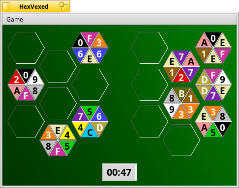

# HexVexed

Hexvexed is a stable hexagon based tile puzzle game forked from DarkWyrm's BeVexed(A maddeningly-addictive puzzle game, which was inspired by the Linux game TetraVex) code to support 6 sides instead of four

The concept is simple: put the hexagon tiles in the grid on the left such that the numbers match wherever 2 tiles touch.
A variation was added to allow for playing the game with different number bases, such as Binary, Octal and Hexadecimal.

If you have ideas regarding fixes and/or new features, you can email them to scottmc2@gmail.com